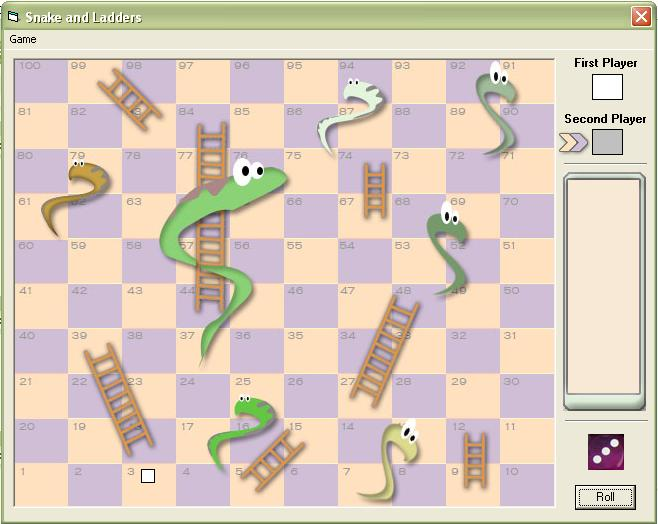



## Snakes and Ladders

### Description

We are all familiar with the game Snake and Ladders. We have been playing such game since

we were kids and in fact, even when we grew up we still play this traditional game for fun.

For those who are not familiar, the logic of the game is simple. The player rolls a die. The number

of the die after rolling will be the number of steps he will move forward. If ever he lands and stops on the feet of any ladder,

He will climb up to a square to where the ladder leads him. This gives him an advantage to reach the last square of the board.

Unfortunately, if ever He stops on any mouth of a snake, He will slide down to a square to where the snake's tail ends.

The player who reaches the last square of the board wins.

This game is in beta version. Although the basic functionality of the game works well, I would like to solicit any recommendations,

comments, remarks from you to further improve this program.

Please critic this game! any comments are most welcome! This program is for you, ultimately free! Please give me feedbacks!

Thanks guys and gals! Have Fun!!
 
### More Info
 

             |
---                |---
**Submitted On**   |2006-12-20 14:19:22
**By**             |[Vincent G\. Binua](https://github.com/Planet-Source-Code/PSCIndex/blob/master/ByAuthor/vincent-g-binua.md)
**Level**          |Intermediate
**User Rating**    |5.0 (35 globes from 7 users)
**Compatibility**  |VB 6\.0
**Category**       |[Games](https://github.com/Planet-Source-Code/PSCIndex/blob/master/ByCategory/games__1-38.md)
**World**          |[Visual Basic](https://github.com/Planet-Source-Code/PSCIndex/blob/master/ByWorld/visual-basic.md)
**Archive File**   |[Snakes\_and20389912222006\.zip](https://github.com/Planet-Source-Code/vincent-g-binua-snakes-and-ladders__1-67446/archive/master.zip)

